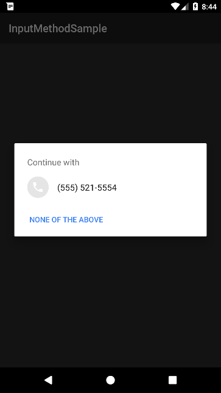
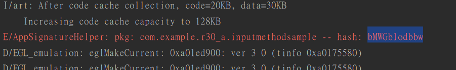
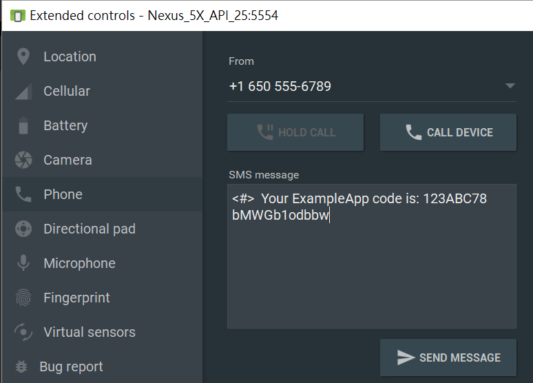

Reference  
[Google SMS retriever]

# Demo Environment: 
AVD Emulator (with GooglePlay Store)

# Steps
1. Run this demo
2. Click 'Test' to pickup a phone number  
(you can send the phone number to your server, then server sends SMS to the specific phone number)  

3. See Android Studio Debug console, copy hash code, paste it in next step.  
(thanks AppSignatureHelper.java, remove it before you publish your app)  

4. Open emulator settings->phone->send message
SMS message format:  
<#>  Your ExampleApp code is: 123ABC78 __bMWGb1odbbw__  

5. SMS send to emulator, the smsRetrieverAPI verify SMS. Here's only two status you can get, success or timeout. if verify result is fail, nothing happened.  

[Google SMS retriever]: https://developers.google.com/identity/sms-retriever/overview/